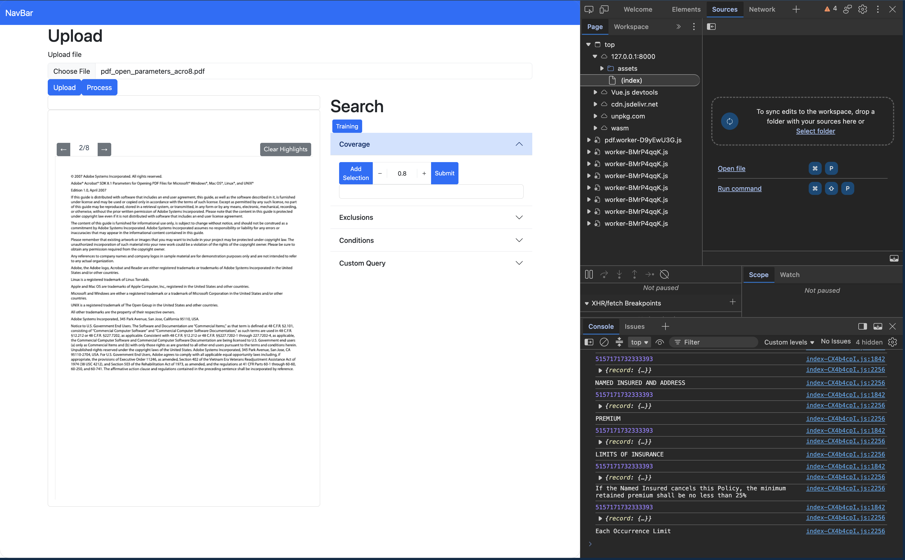

# contract-web

Local, in-browser tool for reviewing contracts.



## Project Setup

```sh
cd client
npm install
```

### Compile and Hot-Reload for Development

This will fail to properly import the worker - must build, first.  There is an error in the worker importing from node_modules: vite converts them to html!

```sh
npm run dev
```

### Compile and Minify for Production

Ensure the following:

* remove page restriction (for testing): `data.js, const TEST_PAGES`
* private contract data at `../contract-data-private/documents/*`


```sh
npm run build
python -m http.server 8000 -d ./dist/
```


# TODO

_Phase I_

* ~~create DocumentRecord in store~~
* ~~create 3 categories of search prompts: coverage + amounts, exclusions, conditions~~
* ~~enable user to select text~~
* ~~improved prompts and scoring~~
* ~~use most current pdfjs-dist~~
* ~~example input~~

_Phase II_

* ~~logic to find and hightlight text~~
* ~~improve highlighting display: PdfDisplay.vue, ln.201: getTextLocation()~~
* ~~add result snippets text highlighting~~
* steps to create for tagging similarity-results (snippets) within pdf
  - enable fill with dynamic cutoff, or use first N items???
  - re-write text on top of ctx.fillRect for better visibility
  - create unique_id on each ctx addition, then add `x` to right-side of each result snippet to remove it
  - fill opacity is not right: too dark (dist=0) or too light (dist=cutoff)???
  - query results are not bad, but you have to fiddle with the cutoff: just take the first N=10???
  - `this.findTextCoordinatesOnCanvas()` coords gets too few of the text???
* make more room to enlargen pdfDisplay
  - change upload file to modal, button in navbar
  - stretch pdfDisplay floor-to-ceiling
* chunking `data.js, ln.211`
* logic to add custom text to modify / refine prompt
* ~~improve setencizer for vectorization~~
* plan to integrate `contract-data` repo
* try graph-rag with `kuzudb`

_Phase III_

* ~~create new component for QueryInput.vue button groups~~
* fix `npm run dev` so workers load
* obfuscate code and cause failure have N+5 days
* use s3 as a static web server
* (maybe) secure s3 with simple password

_Phase III_

* ~~display pdf in viewer~~
* save embeddings with associated document section text to rxdb
* create query input
* embed query input and search against rxdb
